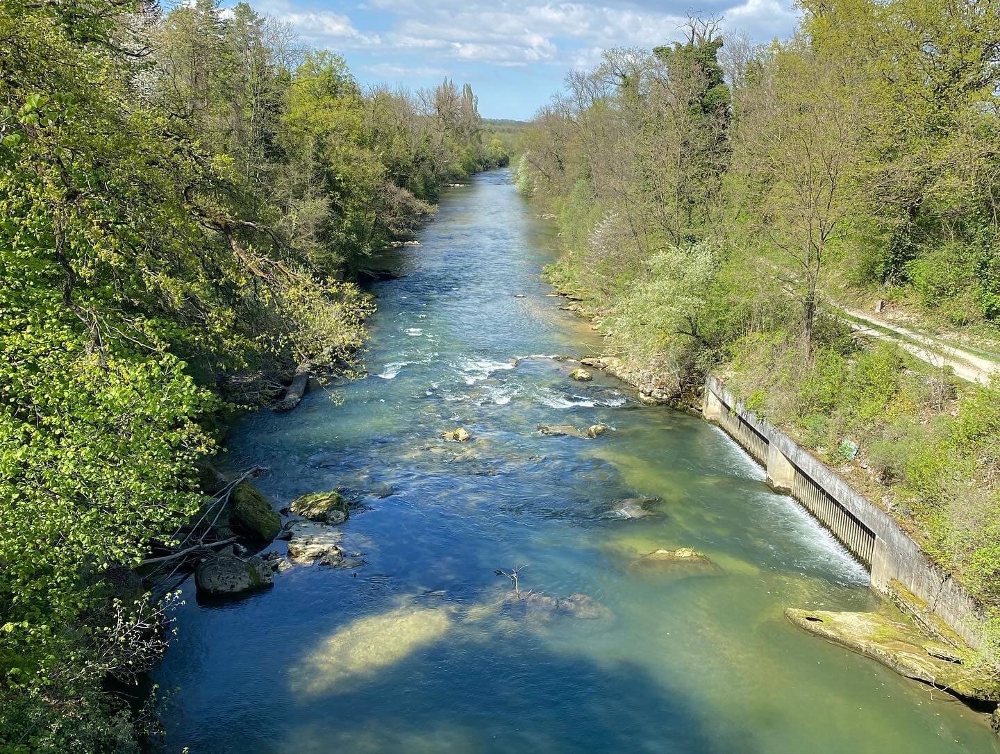
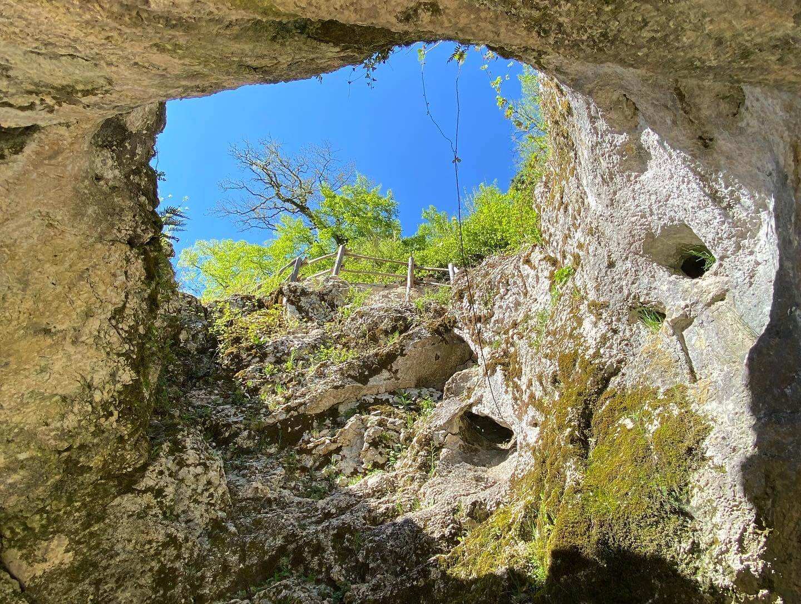
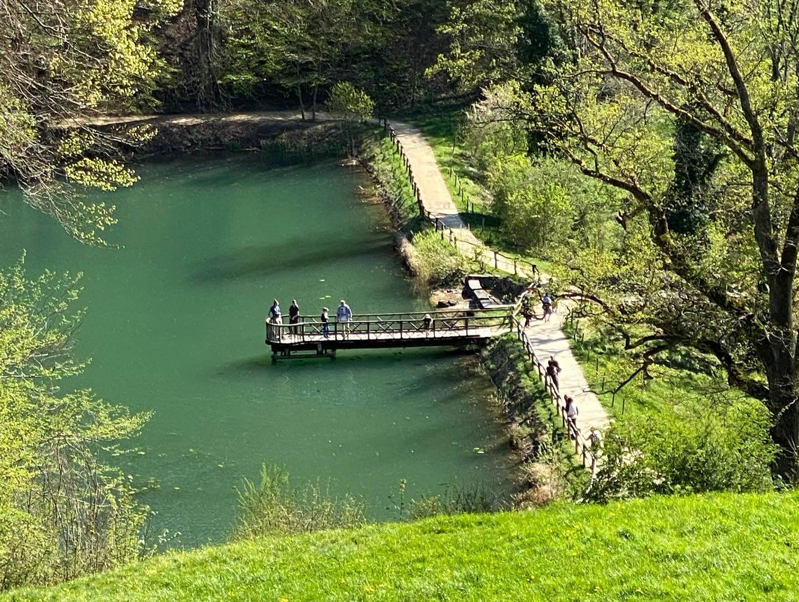
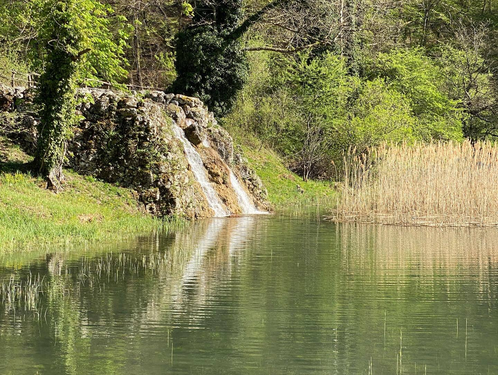
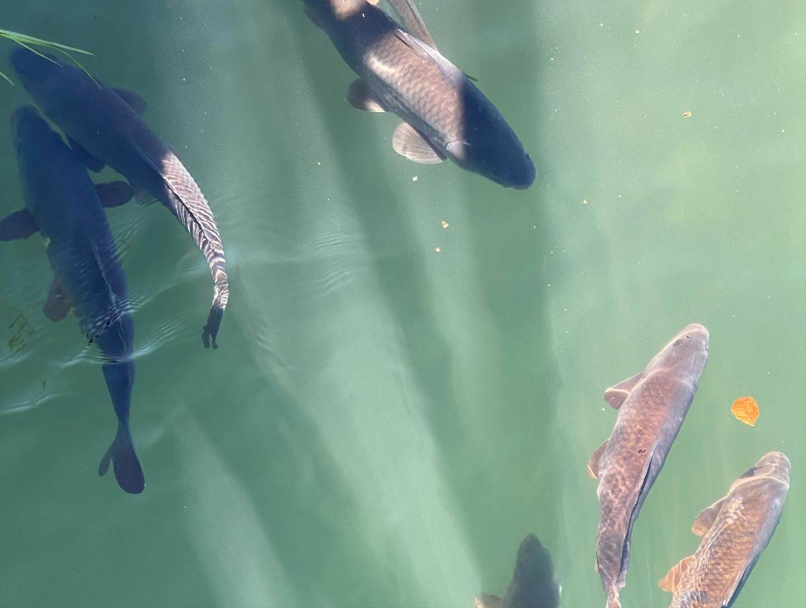
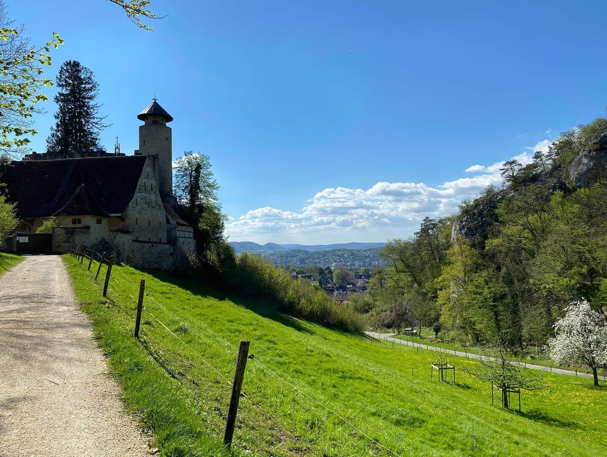

After a long, sleepless night in the overnight train from Amsterdam to Basel, I arrived in the early morning on Wednesday and was greeted by my friends who kindly offered me to let them stay at their place for a couple of days. Since it was still very early in the morning, and I didn't get much sleep during the night, we decided to just sleep some more and boy was it worth it. Finally, some quiet place to stay and sleep which was much needed after the time in Amsterdam. 

*On the way to Arlesheim*

In the afternoon, we headed out for a bit, enjoyed the beautiful weather and the lovely scenery of Switzerland. After that we went into the city of Basel itself, and I was shown around for a bit before we headed back and ended a relaxing night with a good home-cooked meal.

I could already tell that the stay here would be very good to calm down a bit after the time in the Netherlands and the next days were proof of that. We approached every day very slow, starting with a beautiful and rich breakfast outside on the balcony and slowly getting ready to start the day afterwards.

*Part of the caves in Arlesheim*

On Thursday, we had a lovely evening with some drinks and a visit to a club in town until the early morning followed by a *very* relaxed Friday that was mostly just spent on the couch and with some good food. On Saturday, I was shown around in the surrounding area, and I got to visit the Ermitage in Arlesheim with its beautiful nature. We finished the day of with more food and a movie and it was soon time for my last night on the comfiest couch in Switzerland.

*The lakes in the Ermitage, filled with lots of fish*

Sunday morning and I was off to Milano and started to write this post for a bit until I fell asleep on the train. It was Easter Sunday and on my arrival I was surprised by the lack of open places to grab some food, so my dinner was just some sweets that I had brought from Basel.

It is now Monday afternoon, and I have been in the city for 7 hours, walking another 11 km, seeing a lot of the historical landmarks the city has to show and enjoying some good Italian food. I have one more day here tomorrow, which I will most likely spend in Navigli and hopefully get some nice pictures there. Those, as well as the ones from today will be in the next post and on my [Instagram](https://www.instagram.com/bengaminho/).

*Ermitage with a view back to the city*