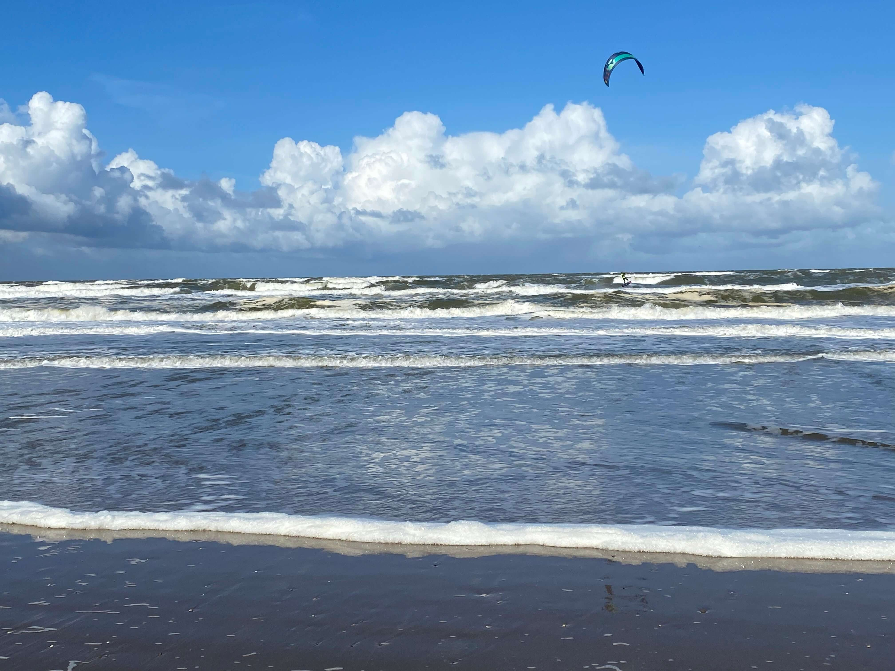
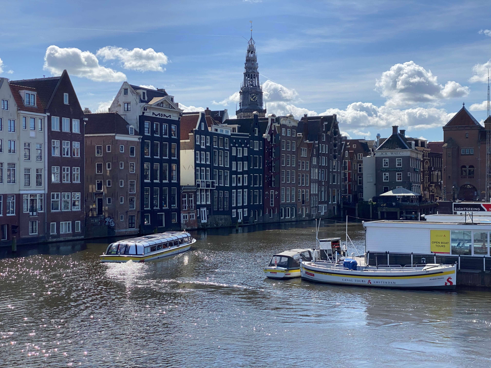
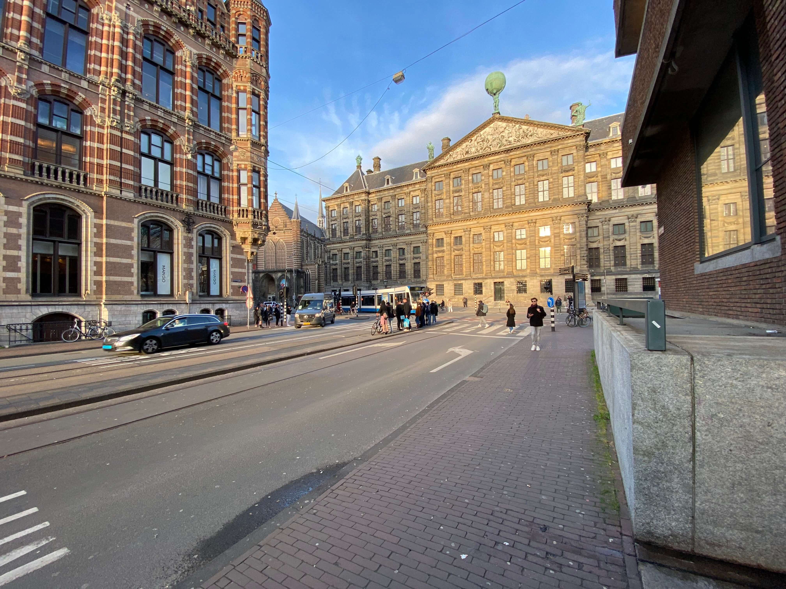
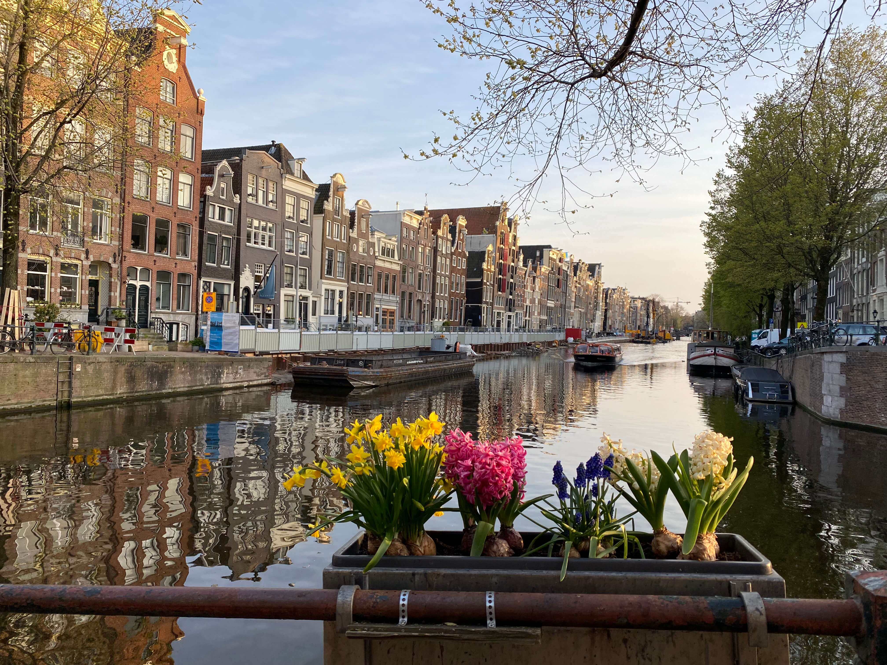
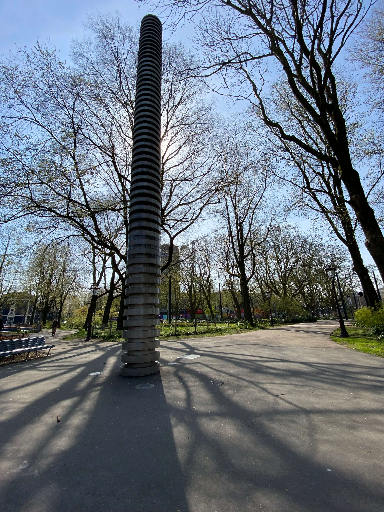

### The calm before the storm
After a wild first night in Noordwijk, my second day was way more relaxed. A long walk along the beach in the morning to clear my head and thoughts followed by some proper Dutch fries were a good start to the day. Or so I thought. My lack of sleep was finally catching up on me and with the wind also picking up immensely and making it sometimes impossible to take a step forward on my way back to the hostel, I arrived there incredibly exhausted. Back at the hostel, there was nothing really going on either and everybody was out somewhere in neighbouring towns. So I did the only sensible thing and went to bed at 3 p.m.!

*The beach was full of kite surfers catching some serious air*

### Going to Amsterdam
On Sunday it was then time to leave to Amsterdam. Upon arrival I was greeted with beautiful sunshine and a whole ton of tourists. I had only been to the city once before, admittedly in extremely rough weather conditions, and the streets were basically empty back then. Nonetheless, I dropped off my luggage at the hostel, and I started walking around the city. And apparently I never stopped. When I checked later, I managed to walk 12 km through the city in just a couple of hours before I decided to end my evening in the hostel lounge.

*One of the first things to see when you leave Amsterdam Centraal*

Little did I know that I would meet one very British and talkative guy there and later on a couple more in the next door coffeeshop. So I was somehow on my feet again, doing some window shopping in the red-light district with a bunch of lads from the UK who could not have acted more like British tourists if they tried. But it was a fun group and when they decided at some point after midnight to go clubbing, I took my leave for the night and went to bed.

*Amsterdam during sundown is a beautiful sight*

I slept for about 12 hours that night, trying desperately to catch up on some sleep and went out today for another marathon through the city. I went to visit the Albert Cuyp street market, which was very lively and full of local and foreign delicacies which kept me too busy to take any pictures there.

But mostly, I just walked around, enjoyed the sun and sat down for a snack in every little park that I came across on my way.

*Amsterdam Frederiksplein – just one of many tiny little green spots throughout the city*

### What's next?
It's now early evening on Monday, and I'm once again sitting in the hostel lounge, typing up this post and somewhat excited to actually leave tomorrow. As beautiful as this city is with its nature, canals and architecture, it is full of tourists, and it is hard to get some authentic Dutch experience here.

Tomorrow then, I'll be leaving to Switzerland, taking the night train and looking very forward to staying with friends there.