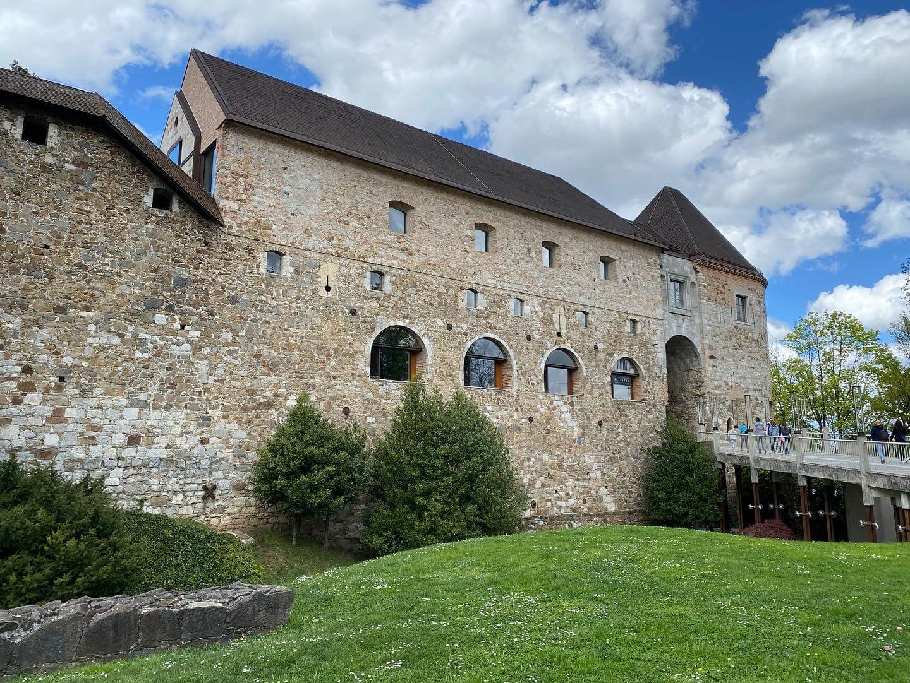
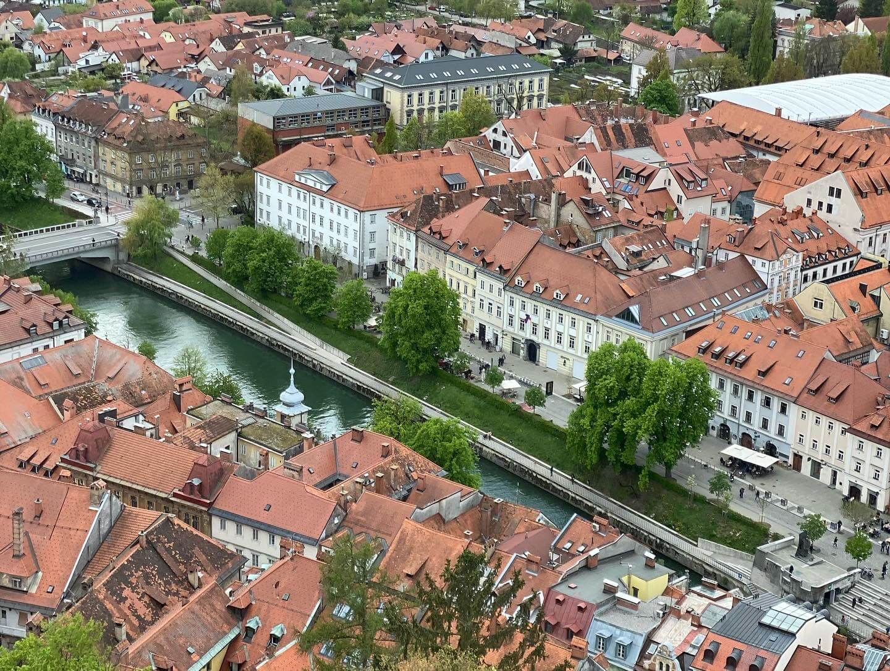
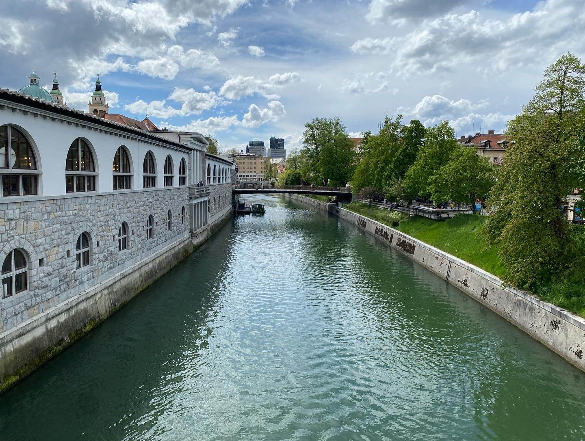
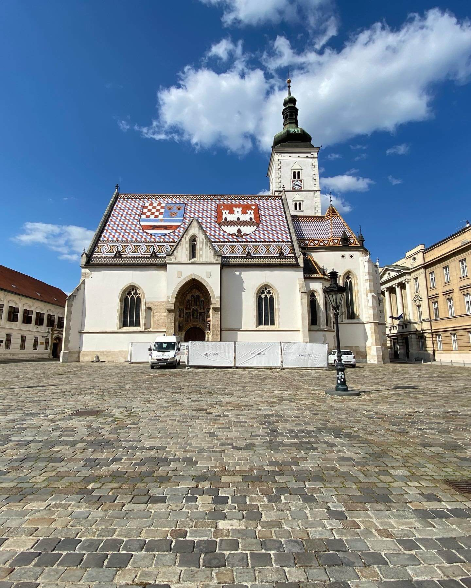
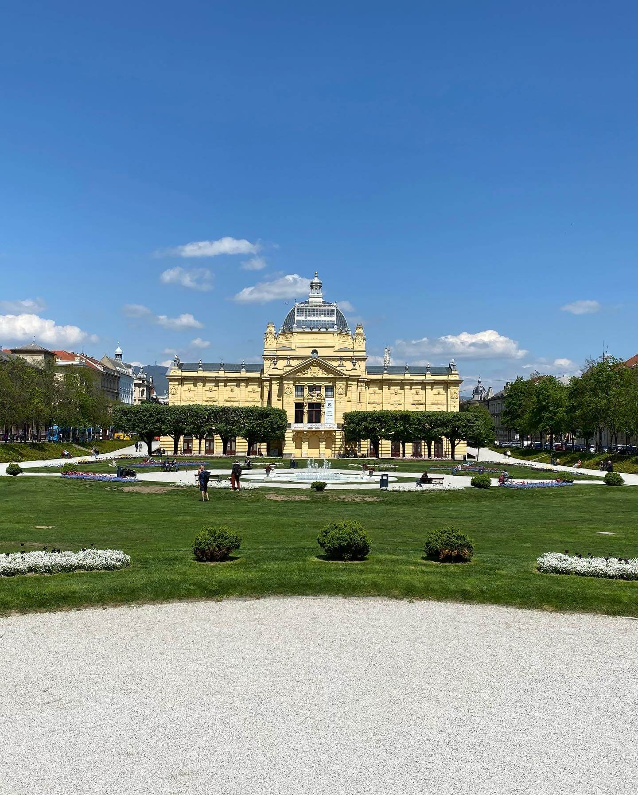
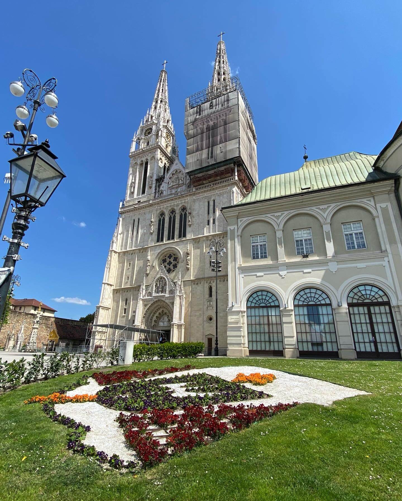

It was a Friday and I was ready to leave Venice when I realised there was a train strike and I had no guarantee of getting to Ljubljana, Slovenia on that day. Panicking a bit, I booked a Flixbus at 6.30 in the morning and then had to spend half a day waiting in Venice to leave. With a long day of waiting for a delayed bus and a long travel time, I finally arrived in Ljubljana at 8 p.m. and went straight to my hostel. I was only going to stay for a night, because I was meeting up with friends from back home here the following day.

So I just checked in quickly, went out for some traditional Slovenian food and headed to bed early. The next day, I went to check in to our AirBnB early in the morning and slept some more, waiting for my friends to arrive in the afternoon. We strolled through town for a bit (*Ljubljana has absolutely gorgeous architecture*) and went to get food twice. We had some decent burgers and good pizza and finished the day off in our apartment with a couple drinks.

The next day we went to visit the castle and I was already feeling a bit under the weather. Nonetheless, we wanted to make use of the good weather while it lasted. And even though it was very windy, the sun was out most of the time and exploring the castle with a guided 'time machine' tour was very entertaining. We listened to actors dressed up as historic figures from the castle's past all the way back from Roman times up until the early 20th century and got a good idea of just how many changes the city and the castle especially went through.

*The Ljubljana Castle and its modern front entrance*

After the tour we explored a bit on our own and got a beautiful view over the city from the viewing tower. It being very windy, I had to tightly hold on to my phone while trying to take pictures because it would have been blown off the tower otherwise.

*View from the top of the tower*

After the castle tour, we went on to our way home and stopped to get some food at an amazing falafel place. If you ever have the chance, definitely go visit *Abi Falafel* in the inner city of Ljubljana. We walked along the Ljubljana River on our way home and sat down once or twice for some more drinks.

*The Ljubljana River*

That evening I fell into bed, very exhausted and feeling a little ill. By the next morning I had a proper cold and stayed at home while the other two went out. When they returned in the evening, they brought me some tea, fruit and food as well as a COVID home test kit which very promptly showed a positive result. So without thinking too much, I locked myself into one of the bedrooms for the next couple of days. It was a blessing and a curse, since I finally was travelling with some friends and wanted to go out with them but at the same time, I was glad that I was knocked out while I could isolate in an AirBnB and have someone to bring me food and check in on me.

*St. Mark's Church in Zagreb*

After staying isolated for a few days, and after I felt better, we continued with our original plan to drive to Zagreb, Croatia and stay there for a few more days. We explored the city, looking at all its sights and were seeking the best foods in town. During the time I was with those two guys, I easily ate double the amount I would usually eat in a day but the cheap prices made it too tempting not to do.

*Zagreb's Art Pavilion*

On our last day we went to the Nikola Tesla Technical Museum, which was a nice change of pace but it's not a must-see I would say. But maybe most technical museums pale in comparison to the one in Speyer, Germany. At least it's been like that from my experience so far. The admission was really cheap though, so you can't go wrong with visiting it.

*The Zagreb Cathedral*

My last worry of the day was how I would continue my travels the next day. I couldn't find a hotel or hostel that would still have an open reception when my train would arrive in Budapest late at night. Even the metro would be closed if my train just had a minimal delay and I would be stuck in the middle of nowhere in a city I've never been to before. I decided on delaying my visit to Budapest by a couple of days and went to Graz in Austria instead early the next morning. This is where I am right now and will probably use that time here to recover some more and catch up on the blog, my pictures and finishing the bookings for the next destinations in advance. All that while enjoying some good food makes for a good use of my time I think.

Thanks to everyone who is still reading these, let me know what you like and don't like about these posts and, as always, much love and check [my Instagram](https://www.instagram.com/bengaminho/) for more pictures and stories!
