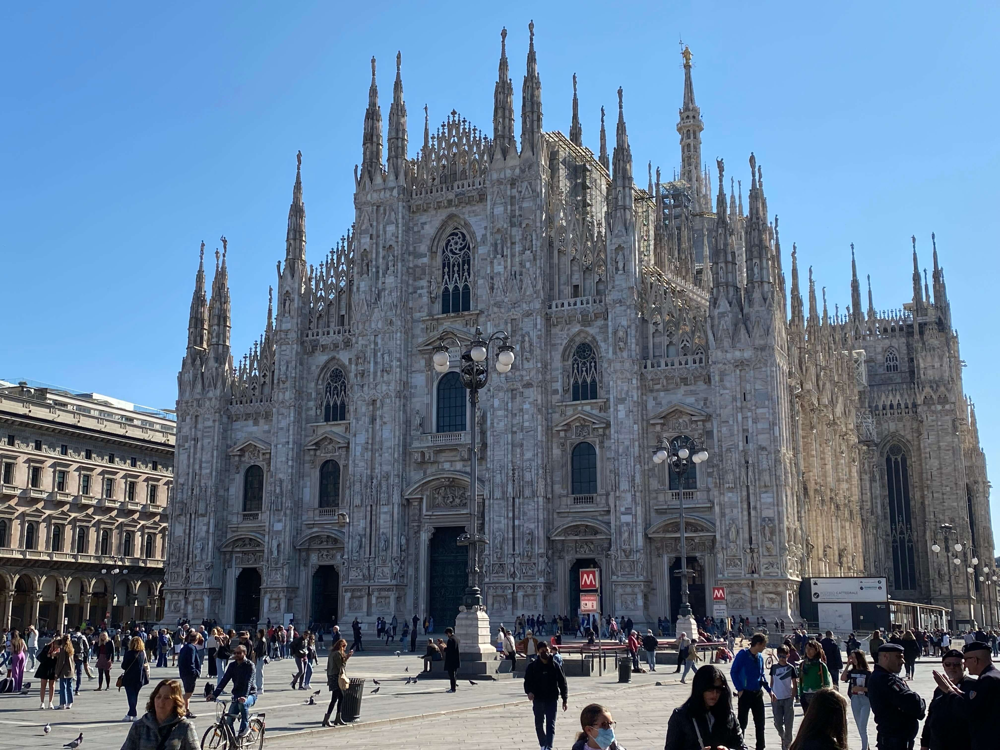
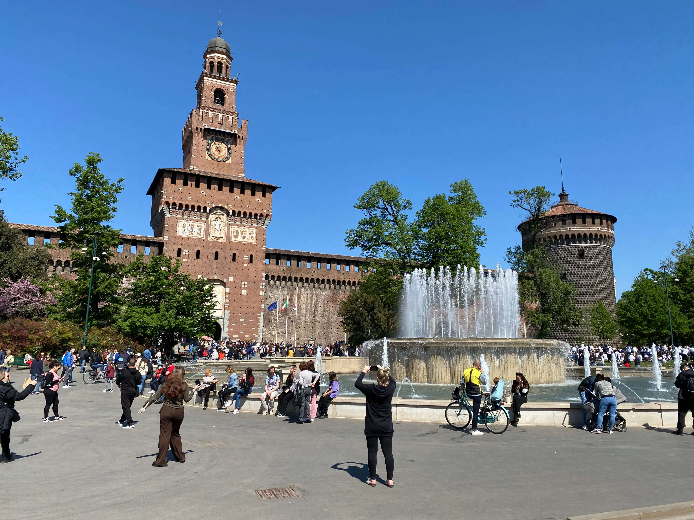
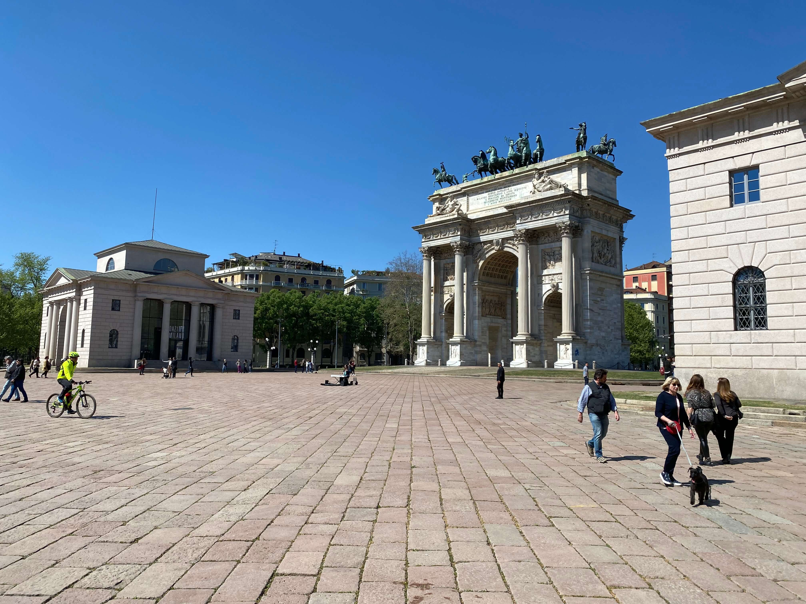
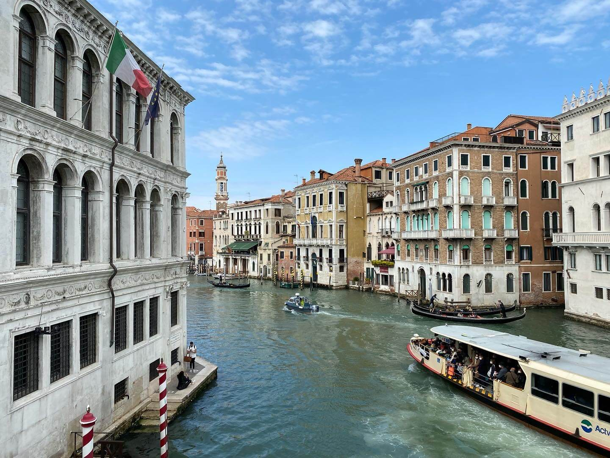
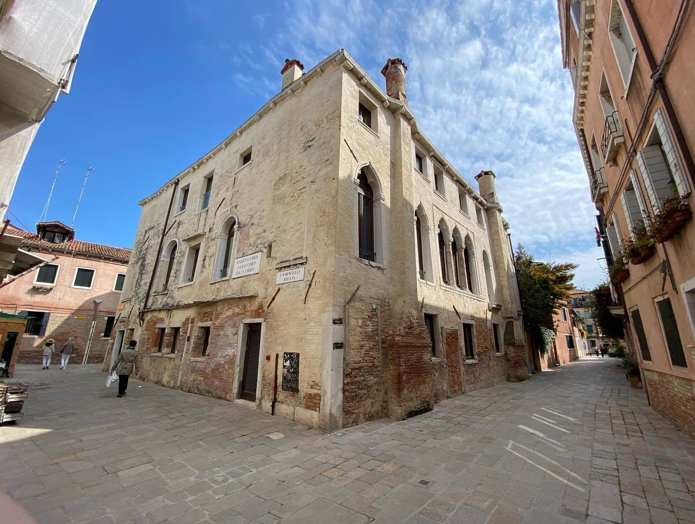
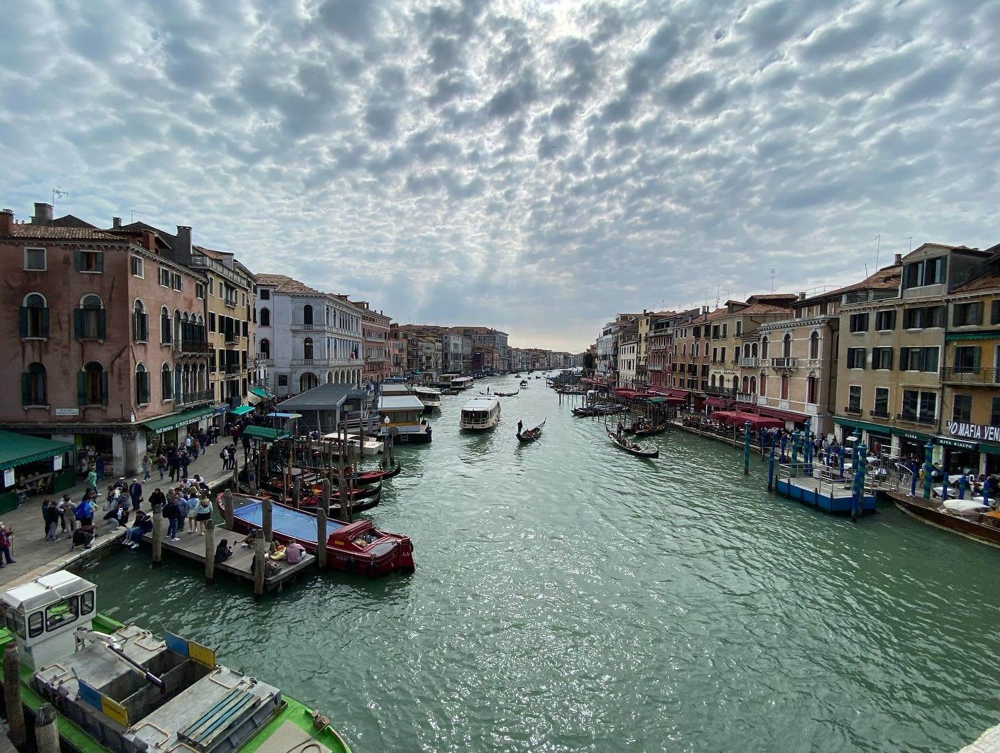
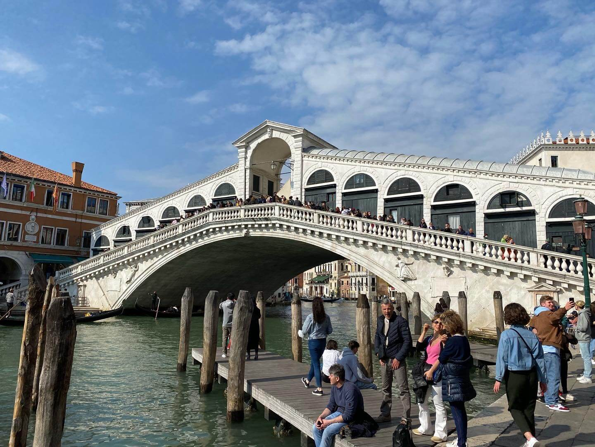
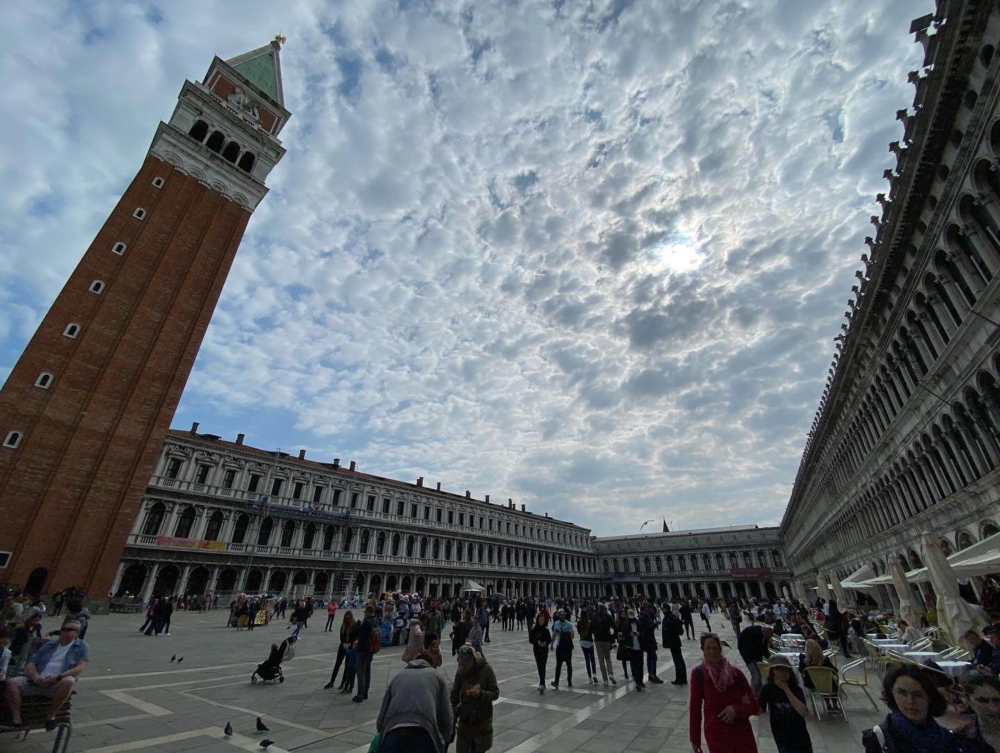

It has been a while since my last entry and there have been reasons for that, but mostly I was just to lazy to write. After leaving Basel, I arrived in Milano and spend 3 nights there before continuing my journey to Venezia. It was a beautiful time there and the weather could not have been better for a late April week, so I mostly explored the city and took pictures wherever I could.

My stay was a little outside the city itself, so my first stop after arriving in the center with the metro was the Duomo. It was a gigantic and gorgeous cathedral, with a huge square outside. 

*The Duomo in Milano*

Wanting to separate myself from the moving masses of tourist, I started wandering around without any clear goal in mind for a while before I got some very disappointing breakfast. 
It was still Easter Monday and apparently restaurants did not want to offer their full menu. But they also just handed out regular menus. So when I tried to order, me and the waiter went back and forth with a 'Could I get ... please?' 'Sorry, we don't have that today, it's a special menu because of Easter'. I basically went through their whole menu before ordering a salad (the only thing they had otherwise were some biscuits), and was severely disappointed with it, especially for the price I paid.

But at least it gave me some time to sit down and plan the rest of my day. I walked all the way to Castello Sforzesco and spent most of the rest of the day in the adjacent Parco Sempione to enjoy the sun and get somewhat of a tan (more like a sunburn, but oh well).

*The Castello Sforzesco with the fountain in front of its southern entrance*

I finished off my walk around town with the Arco della Pace at the north end of the park before walking most of the way back and getting some proper Italian pizza in the city. It was very good, although a bit too pricey because they as well only had their 'special Easter menu' but at least here it was the same as the normal one, just with 2–3 Euros added on the price of every item.

*The Arco della Pace at the northern end of Parco Sempione*

I spent the next day exploring Navigli and some other neighbourhoods around town but honestly did not take too many pictures. Definitely nothing worth showing off here. I had a very good meal for lunch and would recommend everyone who visits Milano to check out *Marghe* on Via Plinio near the Central Station for some of the best pizza I ever had. It might even rank as high as second best!

After that day it was off to Venezia and boy was I exhausted at that point. Having had another three days of running around everywhere in shoes that were hanging on by a thread, my Achilles tendon was irritated and I just wanted to take my travel day off and relax.

Unfortunately, the weather forecast for the next two days was quite bad and since that was all the time I had to stay here, I went out on the day I arrived and tried to see as much of the island as I could within 4–5 hours of sun that I had left on that day.

I went to see the Rialto bridge and the Piazza San Marco and everything you could find on the way there through the tiny alleys of Venice.

*So many possibilities for pictures of random canals or buildings throughout the city*

The Rialto bridge especially was full of tourists, as expected, so I did not spend too much time there. It was enough to get some good shots in though.

*A view from the top of Rialto and a picture of the bridge itself*

Arriving at Piazza San Marco, I was met with some disappointment as there was construction happening everywhere, but especially at the Basilica itself. It was still a nice feeling to stand at the coastline and breath in the watery breeze from the Adriatic Sea.

*Piazza San Marco in Venice. The weather was wonderful to get some photography in.*

The next one and a half days in Venice, the irritation in my leg just got worse and I decided to stay in for most of the time and spend it with some of my roommates in the hostel. It was a nice change of pace and with the weather raining down the whole time, it was the right thing to do.

I have another recommendation for a restaurant in Venezia Mestre, for anyone who wants excellent pasta. *La Tana di Oberix* is a quiet little restaurant that you would easily walk by and with them having the curtains closed, I wouldn't blame anyone for thinking it's closed. I tried my luck anyway and was met with what probably is the best pasta I had in the entirety of my life (and yes, I had Lasagne alla Bolognese in Bologna). I had the Tagliatelle al ragù and can only recommend it to everyone! I finished my meal off with the classic Tiramisu which was also way above average.

Next stop on my journey was Ljublana in Slovenia and I hope to get an update out on that quicker this time.

Thank you for everyone reading this, much love!

