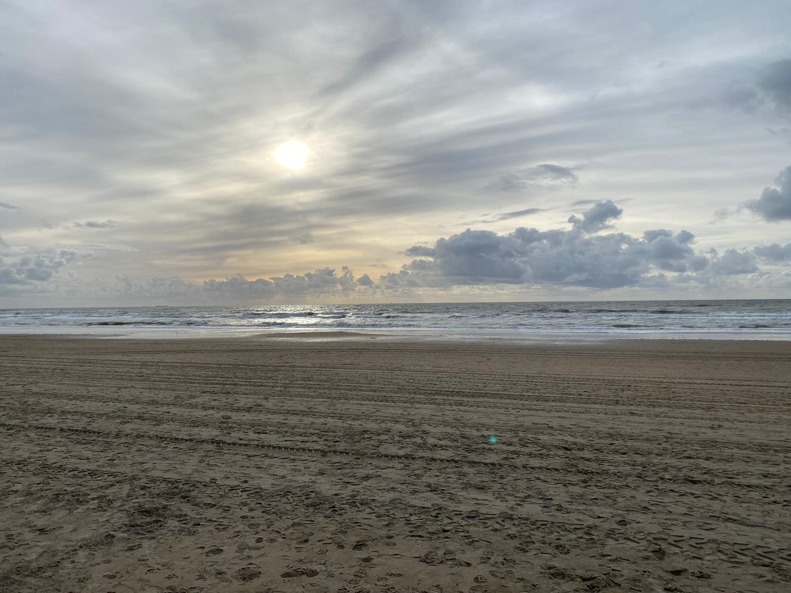

It is finally time. I started my journey around Europe. And it was really tough to leave. I did not sleep at all the night before and was incredibly anxious about leaving the whole time. I was so worried that I was in over my head that I wanted to quit the whole trip altogether. But obviously I still went and after some last minute rush to the train station and barely catching my train I finally arrived at my first destination in Noordwijk. It's a beautiful place and I was welcomed so beautifully by the people in the hostel I'm staying at. I had a great time and a wonderful first night which makes me really excited for the rest of my travels. If it keeps being anything like this, the time is going to fly by in no time!

*A beautiful but windy day in Noordwijk*